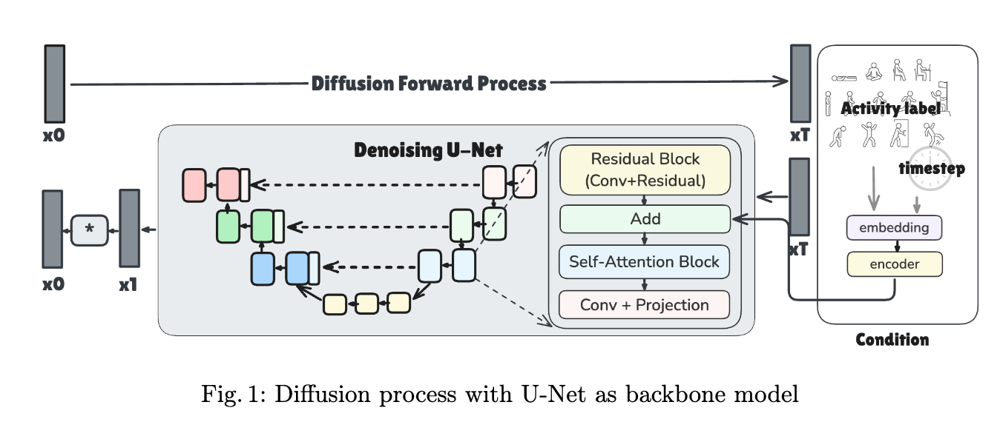
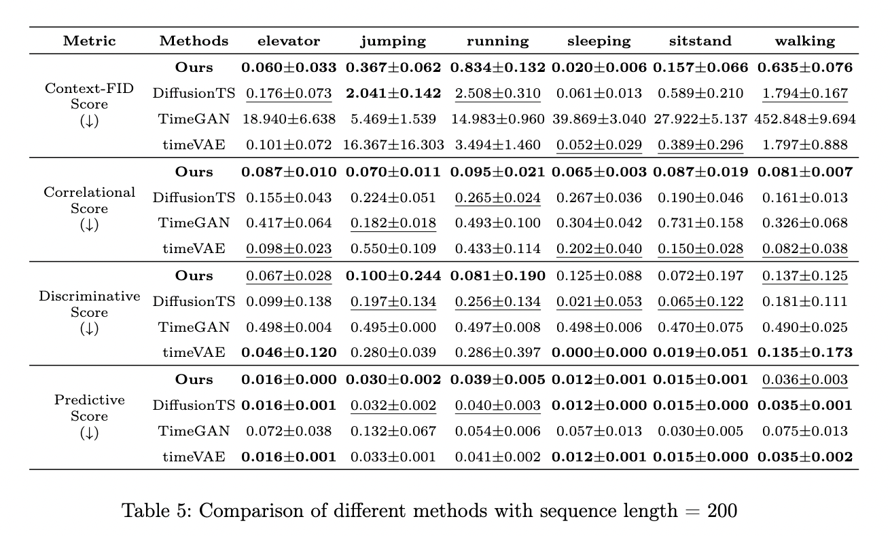
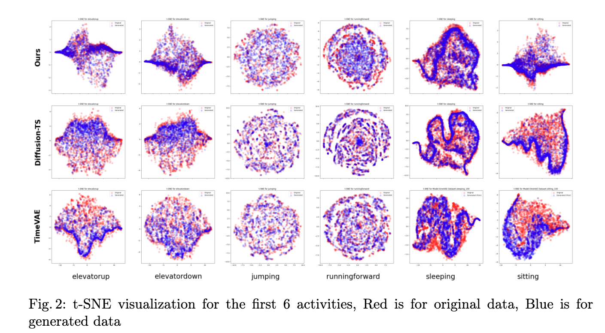
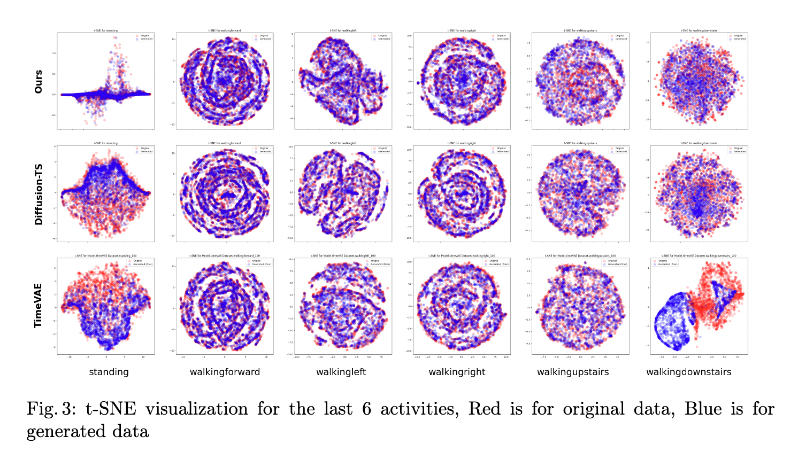
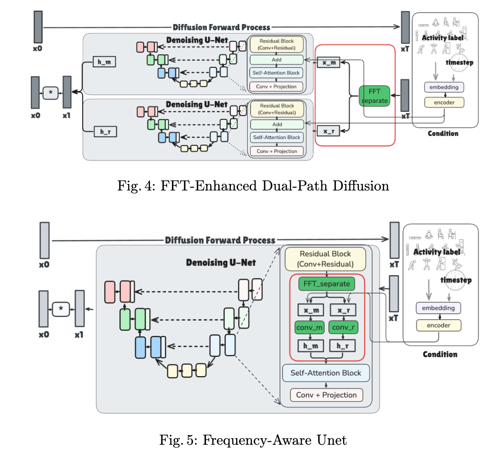

# Activity-Aware Sensor Data Generation via Diffusion Models

This repository contains the implementation of the thesis project titled **"Activity-Aware Sensor Data Generation via Diffusion Models"**. This work leverages denoising diffusion probabilistic models (DDPMs) to generate synthetic sensor data conditioned on activity labels, effectively addressing challenges like data imbalance, privacy concerns, and the lack of diverse datasets.

## Overview
The proposed framework uses a unified U-Net-based architecture, conditioned on activity labels, to generate diverse synthetic sensor data across multiple activities. This approach provides a scalable solution without the need for separate models for each activity, thereby reducing computational overhead while improving data realism and temporal consistency.



## Key Features
- **Activity-Aware Generation**: Embeds activity labels into the diffusion process, enabling contextually accurate synthetic data generation.
- **Scalable and Unified Model**: Uses a single model for multiple activities, eliminating the need for multiple task-specific architectures.
- **Applications**: Useful for human activity recognition, healthcare, wearable devices, and other time-series-related domains.

## Running Commands
To train and test the model, use the following commands:

### Train the Model
```sh
RESULT_FOLDER='genbylabel'
FILE_NAME='main_genbylabel_200.py'
CONFIG_NAME='uschad_genbylabel_200'
GPU=6

python $FILE_NAME --configname $CONFIG_NAME --foldername $RESULT_FOLDER --gpu $GPU --train
```

### Test the Model
```sh
ACTIVITY='elevatordown'
python $FILE_NAME --configname $CONFIG_NAME --foldername $RESULT_FOLDER --activityname $ACTIVITY --gpu $GPU --testid 10
```

## Results
- **Baseline Comparison**: The proposed model outperforms baseline methods like TimeGAN and Diffusion-TS in terms of data realism and consistency.
- **Evaluation Metrics**: Metrics such as Context-FID, Correlational Score, and Predictive Score were used to evaluate the quality of the generated data.



- **t-SNE comparation**



## Future Work
- **Adaptive Conditioning Mechanisms**: To better capture the nuances of each activity.
- **Frequency-Aware Generation**: Further refinement of frequency decomposition techniques for more detailed pattern capture.



## Contact
For more details or contributions, please reach out to the author.

---

